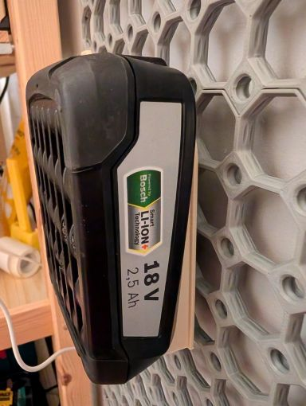
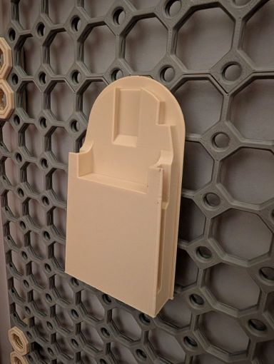

# 3D Printing CADs and STLs
Repository of CAD designs and STL files, primarily for 3D Printing.

## Double swatch holder for 'Fully Printable Filament Storage Rack'

- [GitHub](https://github.com/SiDtheTurtle/3DPrinting/tree/main/SwatchHolderForFilamentSpoolHolder)
- [MakerWorld](https://makerworld.com/en/models/1744616-double-swatch-holder-for-printable-filament-rack)
- [Printables](https://www.printables.com/model/1398572-double-swatch-holder-for-fully-printable-filament)

I wanted some swatch holders to hold the [fenglyu](https://makerworld.com/en/models/70155-filament-sample-card/) style short swatches and to clip them securely to the [Fully Printable Filament Storage Rack](https://www.printables.com/model/388935-fully-printable-filament-storage-rack). Two of the swatches are very slightly shorter than the length of one of these, so it made sense to create a ‘double holder’.

STLs included for each, plus parametric SCAD files if you have scaled the parent model or want to adapt it to your needs.

The default settings in the SCAD and the scale of the STLs seems to work well for my printer, but you may need to tweak the parameters if the clips don't clutch to the pegs.

I push-fitted the clip to the holder, but you may need glue.

Print in the orientation provided.

## MultiConnect
CADs and STLs for any parts I've remixed to connect to MultiBoard or OpenGrid using [MultiConnect](https://www.printables.com/model/1074671-raised-multiconnect-generic-connector-for-multiboa).

### Bosch Battery Holder

- [GitHub](https://github.com/SiDtheTurtle/3DPrinting/tree/main/BoschBatteryHolder)
- [Thingiverse](https://www.thingiverse.com/thing:7133829/files)

Remix of a [Bosch battery holder](https://www.thingiverse.com/thing:5190341), with a MultiConnect cutout.

## eSUN eVacuum Kit Pro Pump Holder

- [GitHub](https://github.com/SiDtheTurtle/3DPrinting/tree/main/eSUNeVacuumKitProPumpHolder)
- [MakerWorld](https://makerworld.com/en/models/1803578-esun-evacuum-kit-pro-pump-holder-for-multiconnect)
- [Printables](https://www.printables.com/model/1417274-esun-evacuum-kit-pro-pump-holder-for-multiconnect)

I wanted a holder for [this filament vacuum bag pump](https://esun3dstore.com/products/evacuum-kit-pro), some exist but they assume you're storing the pump long term, and include something to store the USB cable. Instead I wanted something to store and use the pump in situ and as such holds it upside down using friction, and includes a small cutout so you can leave it plugged in and ready to go. Also includes a space to store a bag clip.

You'll need two Multiconnect flush big screws to mount: https://www.printables.com/model/1160115-flush-multiconnect-generic-connector-for-multiboar.

I kept the width of the connector to one Multiboard wide (25mm), but the width of the holder will encroach onto the adjacent grid slots. It should also work with OpenGrid, as that's a bit bigger still.
