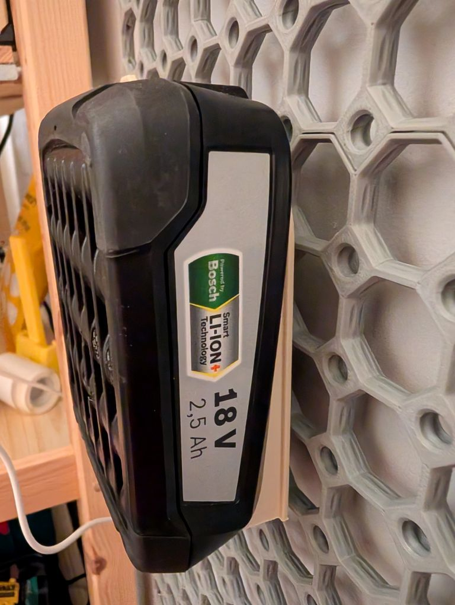
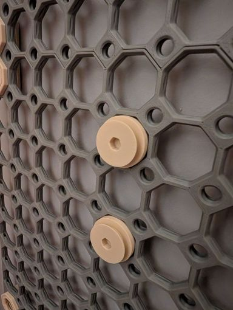
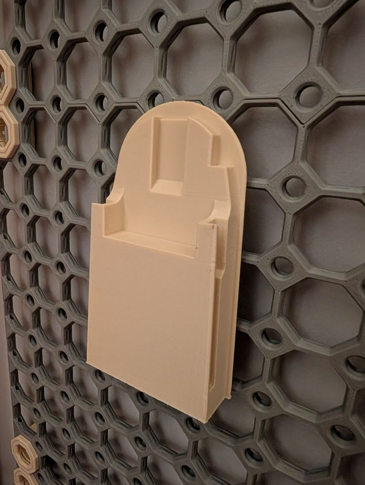

# CAD and STLs
Repository of CAD designs and STL files, primarily for 3D Printing.

## Double swatch holder for 'Fully Printable Filament Storage Rack'

- [GitHub](https://github.com/SiDtheTurtle/CAD/tree/912e159d43ce11807beda35733a5dec7a5a75032/SwatchHolderForFilamentSpoolHolder)
- [MakerWorld](https://makerworld.com/en/models/1744616-double-swatch-holder-for-printable-filament-rack)
- [Printables](https://www.printables.com/model/1398572-double-swatch-holder-for-fully-printable-filament)

I wanted some swatch holders to hold the [fenglyu](https://makerworld.com/en/models/70155-filament-sample-card/) style short swatches and to clip them securely to the [Fully Printable Filament Storage Rack](https://www.printables.com/model/388935-fully-printable-filament-storage-rack). Two of the swatches are very slightly shorter than the length of one of these, so it made sense to create a ‘double holder’.

STLs included for each, plus parametric SCAD files if you have scaled the parent model or want to adapt it to your needs.

The default settings in the SCAD and the scale of the STLs seems to work well for my printer, but you may need to tweak the parameters if the clips don't clutch to the pegs.

I push-fitted the clip to the holder, but you may need glue.

Print in the orientation provided.

## MultiConnect
CADs and STLs for any parts I've remixed to connect to MultiBoard or OpenGrid using [MultiConnect](https://www.printables.com/model/1074671-raised-multiconnect-generic-connector-for-multiboa).

## Bosch Battery_Holder

- [GitHub](MultiConnectAdapters/Bosch_Battery_Holder_with_Multiconnect_Cutout.stl)
- [Thingiverse](https://www.thingiverse.com/thing:7133829/files)

Remix of a [BOSCH battery holder](https://www.thingiverse.com/thing:5190341), with a MultiConnect cutout.
